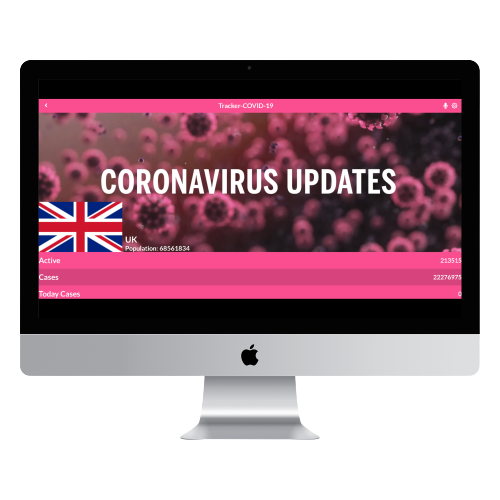

# Tracker-COVID-19
This React capstone project is about building a Mobile Web Application to check a list of metrics (numeric values) that I will create making use of React and Redux. Thanks to the COVID-19 metrics I was able to fetch data by using Fetch API, which helped me to get the all the stats per country needed for the project.

## Screenshots
### Mobile

 

### Desktop

## Built With

- JavaScript (ES6)
- React
- Redux
- Git
- GitHub
- VSCode
- Linters
- Fetch API
- Webpack
- Babel
- CSS
- Sass
- NPM (Software Packages System)

## Live Demo

[Netlify Live Demo Link](https://saidrasynl-tracker-covid-19.netlify.app/)

## Getting Started

To get a local copy up and running follow these simple example steps.

### Prerequisites

- Laptop or Desktop
- Web Browser
- IDE
- Programming Knowledge

### Setup

- Clone GitHub repository `gh repo clone SaidRasinlic/Tracker-COVID-19`
- Install the devDependencies `npm install`
- Build the app `npm run build`
- Run the app `npm run start`

*Congratulations, enjoy the application! It should be on http://localhost:3000/*

## Authors

👤 **Said Rasinlic**

- GitHub: [@GitHub/SaidRasinlic](https://github.com/SaidRasinlic)
- Twitter: [@Twitter/SaidRasinlic](https://twitter.com/SaidRasinlic)
- LinkedIn: [@LinkedIn/SaidRasinlic](https://www.linkedin.com/in/SaidRasinlic)

## 🤝 Contributing

Contributions, issues, and feature requests are welcome!

Feel free to check the [issues page](../../issues/).

## Show your support

Give a ⭐️ if you like this project!

## Acknowledgments

- Microverse 

## 📝 License

This project is [MIT](LICENSE) licensed.
